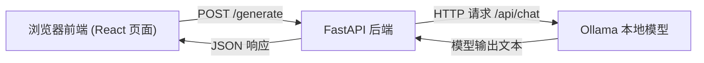

# Day 16 架构设计与目录说明

## 架构图


## 目录设计
```text
day16_20_ai_summary_app/
├── backend/
│   ├── day18_main.py
│   └── day18_requirements.txt
├── frontend/
│   └── day17_app.html
├── docs/
│   ├── day16_architecture.md
│   └── day19_day20_checklist.md
└── README.md
```

## 模块职责
- `frontend/day17_app.html`
- 负责输入文章、选择风格、点击生成、展示结果、错误提示和复制。
- `backend/day18_main.py`
- 负责接收前端请求，拼接 Prompt，请求 Ollama，返回统一 JSON。
- `docs/day19_day20_checklist.md`
- 记录联调和 UX 优化验收项。

## 选型说明
- 前端：React（CDN 版，便于快速起步和演示）。
- 后端：FastAPI（清晰、轻量，适合 API 开发）。
- 模型：本地 Ollama（优先使用本机可用模型）。

## 一句话结论
这个结构可以让我们按 Day 17~20 逐步推进：先页面、再接口、再联调、最后做体验优化。
