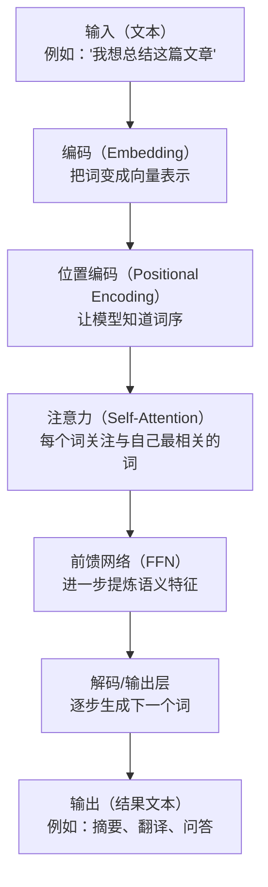

# Day 23：Transformer 直觉简图

```mermaid
flowchart TB
    A["输入（文本）<br/>例如：'我想总结这篇文章'"] --> B["编码（Embedding）<br/>把词变成向量表示"]
    B --> C["位置编码（Positional Encoding）<br/>让模型知道词序"]
    C --> D["注意力（Self-Attention）<br/>每个词关注与自己最相关的词"]
    D --> E["前馈网络（FFN）<br/>进一步提炼语义特征"]
    E --> F["解码/输出层<br/>逐步生成下一个词"]
    F --> G["输出（结果文本）<br/>例如：摘要、翻译、问答"]
```

## 一句话理解
Transformer 的核心是：先把文本变成可计算表示，再用注意力机制找到“哪个词该关注谁”，最后逐步生成输出。

## 和项目的关系
你做 AI 总结助手时，模型之所以能抓住重点并生成结果，本质上就是这条流程在工作。
