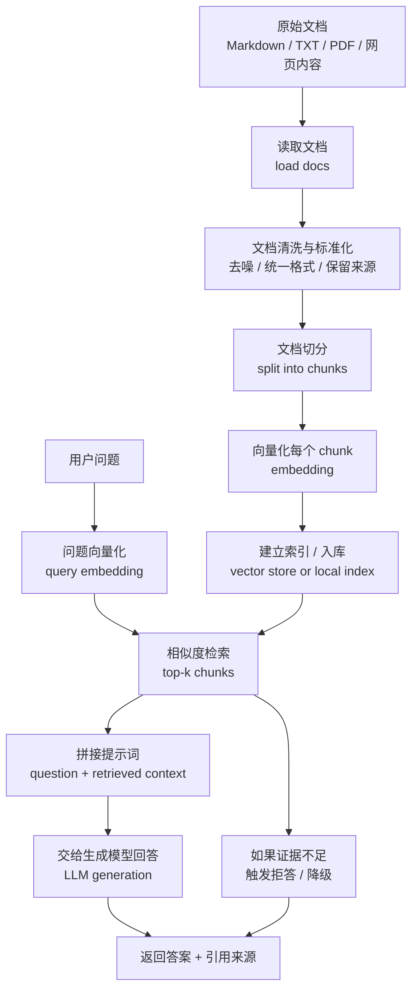

# Day 29：RAG 总流程图与完整说明

## 这份文档要解决什么问题

Day29 的任务表面上是“画 RAG 流程图”，但真正要解决的问题不是会不会画图，而是要先把 RAG 这条主线看清楚。

从今天开始，第 3 阶段的目标不再是单纯做一个“能调用模型的小应用”，而是进入一个更重要的方向：知识库问答。

知识库问答和前一阶段最大的不同在于：

- 前一阶段更像“用户给材料，我当场总结”
- 这一阶段更像“我先准备一批资料，用户提问时系统先去找证据，再根据证据回答”

所以，RAG 的关键不是让模型“更会编”，而是让模型回答前先有依据。

这份文档会回答四个问题：

1. RAG 的完整流程到底包含哪些步骤
2. 每一步分别在做什么
3. 每一步为什么重要
4. 这条流程接下来会如何拆成 Day30～Day40 的具体实现

---

## 一、先用一句话理解什么是 RAG

RAG 可以先粗略理解成：

不是把所有知识都硬塞进模型参数里，而是在用户提问时，先从外部资料里检索相关内容，再把这些内容连同问题一起交给模型生成答案。

它的核心价值有三个：

- 回答更容易基于真实资料，而不是只靠模型记忆
- 可以接入你自己的文档，而不是只依赖公开常识
- 资料更新时，不一定要重新训练模型，只要更新知识库即可

所以，RAG 的重点并不是“模型本身变了”，而是“模型前面多了一条找资料的链路”。

---

## 二、RAG 总流程图

---

## 三、按流程逐步解释：RAG 到底在做什么

下面这部分是今天最核心的理解区。不要把它看成几个孤立术语，而要把它当成一条前后衔接的流水线。

### 1. 读文档（Load Docs）

RAG 的第一步不是问问题，而是先准备知识来源。

这些知识来源可以是：

- `txt`
- `md`
- `pdf`
- 网页正文
- 内部知识文档
- 产品说明、FAQ、学习笔记、技术文档

这一层做的事情，本质上是：

把“人能看的资料”变成“程序能继续处理的文本数据”。

如果没有这一步，后面的切分、向量化、检索都无从谈起。

这一步看起来简单，但很重要，因为文档质量会直接影响后面每一步：

- 文档内容如果杂乱，切分会乱
- 文档格式如果不统一，后面 metadata 会难处理
- 文档来源如果没保留，后面就很难做引用

所以，从一开始就应该有“知识源管理”的意识，而不是临时复制一段文本就算完成。

### 2. 文档清洗与标准化（Clean / Normalize）

严格来说，很多入门流程图会直接从“读文档”跳到“切分”，但实际项目里中间通常有一层清洗和标准化。

这一层常见工作包括：

- 去掉无意义空行、噪音符号、重复标题
- 统一编码和换行格式
- 提取标题、来源、标签等基础信息
- 保留文档 ID、文件路径、标题等元数据

为什么这一步重要：

因为 RAG 后面不是只想“找到一段文本”，而是希望这段文本还能回答这些问题：

- 这段内容来自哪个文件
- 它在原文中的什么位置
- 它属于什么主题
- 它能不能作为引用依据

如果一开始不做标准化，后面系统很容易变成“找到一段话，但不知道它从哪来的”。

### 3. 文档切分（Chunking）

这是 RAG 的关键步骤之一。

因为大部分原始文档不能直接整篇拿去做检索，原因主要有三类：

1. 整篇太长，不适合直接向量化后用于细粒度匹配  
2. 用户问题通常只对应文档中的局部内容，而不是整篇内容  
3. 如果整篇作为检索单位，相关段落会被大量无关内容稀释

所以，RAG 通常会把文档切成多个较小片段，也就是 `chunks`。

常见切分方式有：

- 按固定长度切
- 按段落切
- 按标题层级切
- 按语义边界切
- 带重叠的滑动窗口切分

切分的目标不是“切得越碎越好”，而是让每个 chunk 满足两个条件：

- 信息足够完整，不至于上下文断裂
- 体量足够小，便于精确检索

这一步会直接影响后面的检索质量，所以 Day31、Day34、Day35 会围绕它反复练习。

### 4. 向量化（Embedding）

切分之后，每个 chunk 还是普通文本。普通文本不能直接做高效语义检索，所以需要把文本转换成向量表示。

这里要特别注意：

- 生成模型负责“写答案”
- embedding 模型负责“把语义映射成向量”

这两者不是一回事。

向量化之后，每个 chunk 都会变成一组数字。程序不会“看懂”这些数字的语义细节，但可以通过向量距离去近似判断：

- 哪些文本语义相近
- 用户问题更接近哪些 chunk

所以 embedding 的作用不是生成内容，而是为“找相关资料”服务。

这是 RAG 和普通问答系统最重要的基础差异之一。

### 5. 建立索引 / 入库（Build Index）

当 chunk 都有向量之后，下一步通常不是立刻回答，而是把这些向量组织进可检索结构里。

这个结构可以是：

- 本地内存索引
- 简单文件索引
- 轻量向量数据库
- 更完整的向量检索系统

这一层的本质是：

提前把知识整理好，等用户提问时可以更快地找到相近内容。

如果没有索引，系统每次提问都要重新对所有文档做全量处理，效率会很差。

所以这一步可以理解为：

先把知识库“编好目录”，后面才能快速查找。

### 6. 用户提问（User Query）

到这里，知识库侧已经准备好了。接下来才轮到用户真正发起问题。

例如：

- “React 的 key 为什么重要？”
- “如何理解数据库事务？”
- “什么是上下文窗口？”

这一刻系统不会直接把问题扔给生成模型，而是先做检索准备。

这也是 RAG 和普通聊天最大的区别：

普通聊天：
用户问题 -> 模型直接回答

RAG：
用户问题 -> 先找资料 -> 再基于资料回答

### 7. 问题向量化（Query Embedding）

和文档 chunk 一样，用户问题也要被转成向量。

只有当“问题向量”和“chunk 向量”处在同一个向量空间里，系统才能比较它们之间的相似度。

这一步本质上是在问：

“这个问题在语义上，最像知识库里的哪些内容？”

这也是为什么检索系统不是简单关键词匹配。它更希望找到“意义相关”的内容，而不只是字面重合。

### 8. 相似度检索（Retrieve Top-K）

有了问题向量之后，系统会去索引里找最相关的若干个 chunk，一般叫做 `top-k` 检索结果。

例如：

- 取最相似的前 3 段
- 取前 5 段
- 取前 8 段

这一层的输出不是最终答案，而是“候选证据”。

这一步的关键目标是：

尽量把真正有帮助的上下文找出来，同时尽量减少无关内容。

因为一旦检索错了，后面的生成再强也会建立在错误证据上。

所以 RAG 里有一个非常重要的认识：

很多回答质量问题，根本原因不在生成阶段，而在检索阶段。

### 9. 拼接 Prompt（Assemble Context）

当系统拿到了检索结果后，下一步不是直接把这些原文片段裸丢给模型，而是要组织成一个更合理的 Prompt。

通常会拼成类似结构：

- system 指令：要求模型只能根据检索内容回答
- 用户问题
- 检索到的上下文片段
- 输出格式要求
- 引用或拒答规则

这一步其实是 RAG 的“桥梁层”。

前面的检索链路负责找资料，后面的生成模型负责写答案，而这一步负责把“资料”变成“模型可用输入”。

如果这里组织不好，就会出现很多问题：

- 检索到了对的内容，但模型没用好
- 上下文顺序混乱，模型抓错重点
- 没有明确限制，模型又开始脱离证据自由发挥

所以 RAG 并不是“检索做好就行”，Prompt 组织依然很重要。

### 10. 生成回答（Generation）

这一步才轮到生成模型真正输出答案。

但和上一阶段不同的是，这里的答案理想状态下不应该主要依赖模型参数记忆，而应该主要依赖检索到的上下文。

也就是说，这一步更接近：

“请根据我刚给你的资料来回答”

而不是：

“请你凭印象回答”

这也是为什么后面会专门学习：

- 如何让模型更依赖检索内容
- 如何引用来源
- 如何证据不足时拒答

### 11. 返回答案与引用（Answer with Citations）

最基础的 RAG 可以只返回答案，但更实用的 RAG 通常还要返回：

- 来源文档标题
- chunk 所属文件
- 片段编号
- 引用文本

因为知识库问答的一个核心价值就是“可追溯”。

用户不只关心答案对不对，还会关心：

- 你这个结论是从哪来的
- 我能不能回到原文自己核对

如果没有引用，RAG 和普通聊天就会越来越像，优势会被削弱。

### 12. 证据不足时拒答（Fallback / Refuse）

这是很多新手最容易忽略的一层。

RAG 不是“检索 + 生成”就结束了，更稳的系统还应该具备一个能力：

当没有找到足够证据时，不要硬答。

也就是说，系统应该学会区分两种情况：

- 找到了相关证据，可以回答
- 没找到足够证据，应该明确说明“不确定”或“知识库中没有足够信息”

这一层会在 Day43 继续展开，但今天要先知道：

RAG 的目标不是“无论如何都给答案”，而是“有证据再回答”。

---

## 四、把整个 RAG 流程压缩成两个大阶段来看

如果觉得上面的步骤很多，可以先把它压缩成两个大阶段。

### 阶段 A：离线准备阶段

这一阶段不需要用户实时参与，主要是在“建知识库”。

包含：

- 读文档
- 清洗标准化
- 切分 chunk
- 做 embedding
- 建立索引

这一阶段的关键词是：

先把资料准备好。

### 阶段 B：在线问答阶段

这一阶段发生在用户提问时。

包含：

- 用户输入问题
- 问题向量化
- 从索引中检索相关 chunk
- 拼接 Prompt
- 生成答案
- 返回答案与引用 / 拒答

这一阶段的关键词是：

先找证据，再回答。

如果能把这两个大阶段分清楚，RAG 的总体结构就已经很清晰了。

---

## 五、RAG 和上一阶段“总结助手”的本质区别

为了帮助你把新阶段和旧阶段衔接起来，这里做一个对比。

### 上一阶段总结助手的路径

用户直接提供原文  
-> 后端组织 Prompt  
-> 模型直接基于这段原文总结  
-> 返回结果

这里的关键特点是：

- 知识来源就在当前请求里
- 不需要额外检索
- 更像“单次任务处理”

### RAG 的路径

系统先准备一批知识文档  
-> 建立切分和向量索引  
-> 用户提问  
-> 先从知识库里找相关片段  
-> 再让模型基于片段回答

这里的关键特点是：

- 知识来源不一定在当前请求里
- 回答前必须先检索
- 更像“带知识库的问答系统”

所以，从总结助手到 RAG，不是推倒重来，而是在原有“前端 -> 后端 -> Prompt -> 生成”链路前面，又加了一层“知识检索”。

这也是为什么前一阶段学的很多东西并没有作废：

- Prompt 依然重要
- 错误处理依然重要
- 成本意识依然重要
- 前端交互依然重要

只是现在系统结构更长了。

---

## 六、Day29 之后每天会分别接哪一段流程

这部分很重要，因为今天的流程图不是画完就结束，它会直接变成后面每天的施工图。

### Day30：Embedding 是什么

对应今天流程里的：

- 文档向量化
- 问题向量化

重点是弄清楚“生成模型”和“向量表示”不是一回事。

### Day31：Chunking

对应今天流程里的：

- 文档切分

重点是理解不同切分方式为什么会影响检索质量。

### Day32：准备文档集

对应今天流程里的：

- 原始文档准备
- 知识源选择

重点是先确定你要让系统回答什么主题的问题。

### Day33：写文档读取脚本

对应今天流程里的：

- 读文档
- 标准化输入

### Day34：写切分脚本

对应今天流程里的：

- split into chunks

### Day35：检查切分结果

对应今天流程里的：

- 验证 chunk 是否合理

### Day36：理解向量数据库

对应今天流程里的：

- 建立索引 / 入库

### Day37：实现 Embedding

对应今天流程里的：

- embedding

### Day38：实现索引构建

对应今天流程里的：

- build index

### Day39：实现检索器

对应今天流程里的：

- query embedding
- top-k retrieval

### Day40：完成最小 RAG 闭环

对应今天流程里的：

- question + retrieved context
- generation
- answer

也就是说，Day29 其实是在先把整张地图画出来，这样后面每天都知道自己正在修哪一段路。

---

## 七、今天最容易产生的几个误解

### 误解 1：RAG 就是“给模型多喂点资料”

不准确。

RAG 不是简单把更多文本塞进 Prompt，而是先建立一套“能按问题动态找资料”的机制。

### 误解 2：做了 embedding 就等于做完 RAG

不对。

embedding 只是中间一步。没有切分、没有索引、没有检索、没有生成组织，都还不能称为完整 RAG。

### 误解 3：检索到了内容，答案就一定会好

不一定。

如果 Prompt 组织不好、上下文太乱、模型没有被约束“必须基于证据回答”，依然可能输出不稳。

### 误解 4：RAG 的价值是让模型知道更多

更准确地说，RAG 的价值不是让模型“知道更多”，而是让模型“在回答时能先找到更可靠的外部依据”。

### 误解 5：RAG 只适合大型项目

不是。

RAG 很适合初学者练习，因为它正好把很多关键能力串在一起：

- 文档处理
- 数据结构
- 检索
- Prompt
- 前后端联调
- 稳定性
- 评测

---

## 八、今天这一步会在后面的哪个项目里派上用场

今天画的这张 RAG 流程图，会直接成为你后面做“知识库问答项目”的总蓝图。

以后无论你做：

- 技术文档问答
- 个人笔记知识库
- 公司 FAQ 助手
- 学习资料检索问答
- 带引用的知识助手

本质上都绕不开今天这条链路：

读文档 -> 切分 -> 向量化 -> 检索 -> 生成 -> 引用 / 拒答

也就是说，Day29 的价值不是学一个新名词，而是先把后面 20 天要走的主线完整看清楚。

---

## 九、如果我要用一句话总结今天

RAG 的本质不是让模型直接回答更多问题，而是让系统在回答前，先从外部知识库里找到相关证据，再基于证据组织回答。

---

## 十、今日记录

- 今天有没有真正写代码：有，完成了 `day29_rag_flow.md` 文档与流程图整理。
- 今天有没有产出一个可见结果：有，产出了一份可复盘、可作为后续施工图的 RAG 流程文档。
- 今天能不能用一句话说清楚“我学这个是为了什么”：能。是为了后面做真正的知识库问答系统，而不是只会做单次提示词任务。
- 学到的重点：RAG 不是一个单点技术，而是一条由“文档处理 + 检索 + 生成”串起来的完整链路。
- 遇到的问题：最容易混淆的地方是把 embedding、检索、生成混成一件事。今天通过流程图把它们拆开后，整体结构清楚很多。
- 明天的衔接点：进入 Day30，先把“生成模型”和“embedding 模型”的区别彻底讲清楚。

## 一句话复盘

我今天完成了 RAG 总流程图，已经能够从整体上理解：知识库问答不是直接问模型，而是先准备知识、再检索证据、最后基于证据生成答案。
